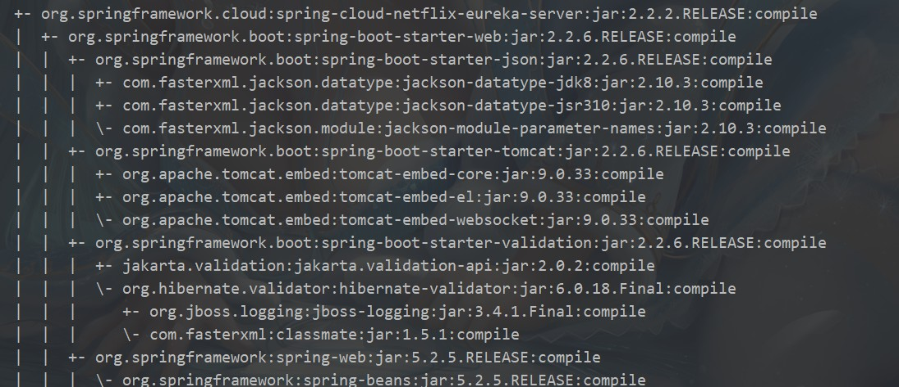
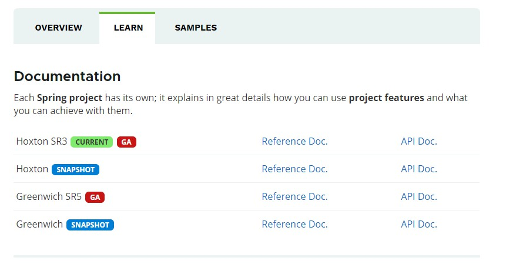
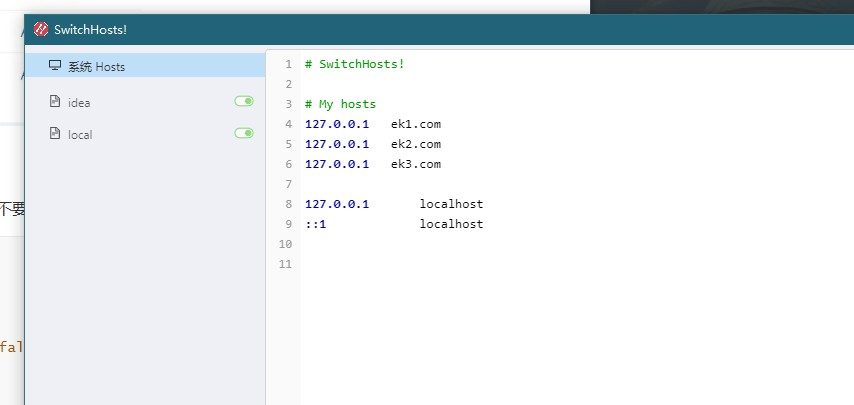
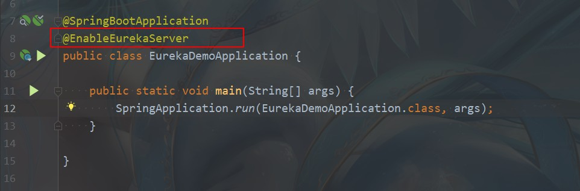
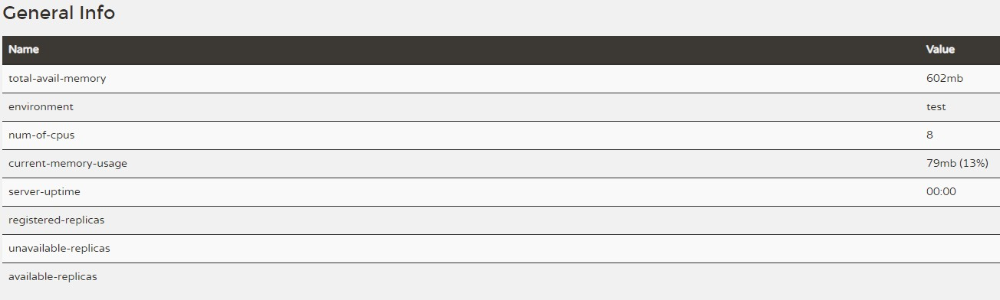
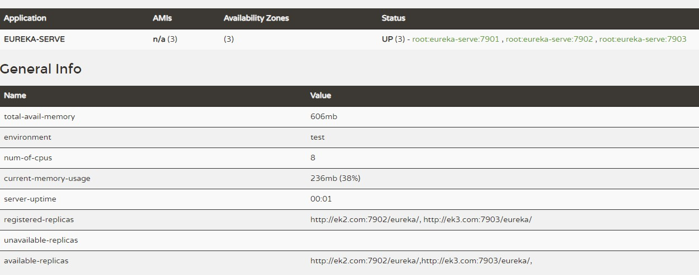
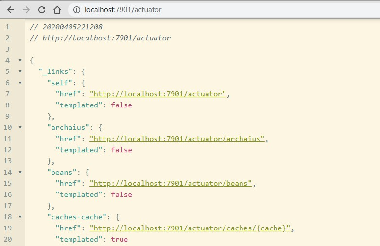
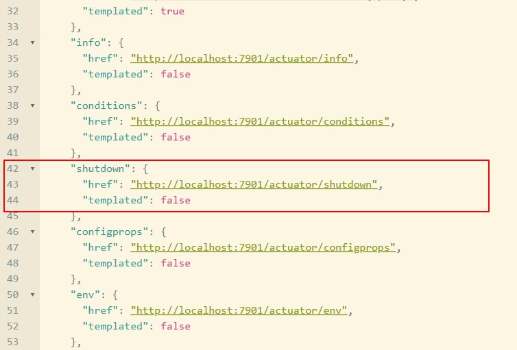

## Spring Cloud Eureka

#### Eureka 单节点和集群搭建的研究以及常见坑位

**前言** 上生产前最好先看下官方对 eureka 的介绍

`The existing open source work on eureka 2.0 is discontinued. The code base and artifacts that were released as part of the existing repository of work on the 2.x branch is considered use at your own risk.`

`Eureka 1.x is a core part of Netflix's service discovery system and is still an active project.`

**大致意思** eureka 2.0 停止维护,使用后果自负(tag 好吓人),不过我们用1.x 就可以了,稳定运行那么多年了是吧

// 不过我相信现在应该没人用吧(mvc dependency:tree 查询项目依赖,不知道的可以查查) 

// 我的 demo 项目包括单点和集群都是v1.9.18 (tag 在我写这篇文章时, eureka 最新版本v1.9.19)

// `pom.xml`

``` xml
   <?xml version="1.0" encoding="UTF-8"?>
<project xmlns="http://maven.apache.org/POM/4.0.0"
         xmlns:xsi="http://www.w3.org/2001/XMLSchema-instance"
         xsi:schemaLocation="http://maven.apache.org/POM/4.0.0 https://maven.apache.org/xsd/maven-4.0.0.xsd">
    <modelVersion>4.0.0</modelVersion>
    <parent>
        <groupId>org.springframework.boot</groupId>
        <artifactId>spring-boot-starter-parent</artifactId>
        <version>2.2.6.RELEASE</version>
        <relativePath/> <!-- lookup parent from repository -->
    </parent>
    <groupId>com.girhub.wuliuqi</groupId>
    <artifactId>eureka-demo</artifactId>
    <version>0.0.1-SNAPSHOT</version>
    <name>eureka-demo</name>
    <description>Demo project for Spring Boot</description>

    <properties>
        <java.version>1.8</java.version>
        <spring-cloud.version>Hoxton.SR3</spring-cloud.version>
    </properties>

    <dependencies>
        <dependency>
            <groupId>org.springframework.cloud</groupId>
            <artifactId>spring-cloud-starter-netflix-eureka-server</artifactId>
        </dependency>

    <dependencyManagement>
        <dependencies>
            <dependency>
                <groupId>org.springframework.cloud</groupId>
                <artifactId>spring-cloud-dependencies</artifactId>
                <version>${spring-cloud.version}</version>
                <type>pom</type>
                <scope>import</scope>
            </dependency>
        </dependencies>
    </dependencyManagement>

    <build>
        <plugins>
            <plugin>
                <groupId>org.springframework.boot</groupId>
                <artifactId>spring-boot-maven-plugin</artifactId>
            </plugin>
        </plugins>
    </build>

不需要引入 spring-boot-starter-web，因为上面的依赖已经包含了它,可以参考下面的依赖图
```



// 应为 spring cloud eureka 基于 spring boot 开发,所以 eureka 会自动依赖 spring boot,并且版本都给我们选好了

// spring boot 和 spring cloud 是有版本对应关系的,可以去官网看看,别搞错了


// 再介绍下 spring cloud 官网的版本

`GA: General Availability`,正式发布的版本，官方推荐使用此版本。在国外都是用GA来说明release版本的。

`PRE`: 预览版,内部测试版. 主要是给开发人员和测试人员测试和找BUG用的，不建议使用；

`SNAPSHOT`: 快照版，可以稳定使用，且仍在继续改进版本



#### 单节点搭建

`application.yaml` 文件 (常见后缀都是可以的yml properties spring boot 都会读取到,不要在这纠结)

```yaml
eureka: 
  instance:
    hostname: ek1.com
  client:
    #是否将自己注册到Eureka Server,默认为true，由于当前就是server，故而设置成false，表明该服务不会向eureka注册自己的信息
    register-with-eureka: false
    #是否从eureka server获取注册信息，由于单节点，不需要同步其他节点数据，用false
    fetch-registry: false
    #设置服务注册中心的URL，用于client和server端交流
    service-url:                      
      defaultZone: http://ek1.com:7900/eureka/
```





// 效果(tag 界面的一些项的意思大家摸索就可以了,很简单)




#### 集群搭建

网上有很多搭建集群的方法,我给的集群是包含了关闭自我保护模式的集群(tag 可能你会问为什么呢?自我保护模式)

`当你搭建好一个集群之后,稳定在线上运行,某天某一个节点挂掉,但是 默认eureka 是非常乐观的,认为你很快会连接上,注册列表不会删除过期的节点,这你就悲剧了`

`关闭自我保护模式并进行一些设置会让你的 eureka 实时监测节点状态,下面再详细解释下`

**自我保护模式**

如果Eureka Server最近1分钟收到renew的次数小于阈值（即预期的最小值），则会触发自我保护模式，此时Eureka Server此时会认为这是网络问题，它不会注销任何过期的实例。等到最近收到renew的次数大于阈值后，则Eureka Server退出自我保护模式。

自我保护模式阈值计算：

- 每个instance的预期心跳数目 = 60/每个instance的心跳间隔秒数
- 阈值 = 所有注册到服务的instance的数量的预期心跳之和 *自我保护系数

以上的参数都可配置的：

- instance的心跳间隔秒数：eureka.instance.lease-renewal-interval-in-seconds
- 自我保护系数：eureka.server.renewal-percent-threshold

如果我们的实例比较少且是内部网络时，推荐关掉此选项。我们也可以通过eureka.server.enable-self-preservation = false来禁用自我保护系数

```yaml
server:
  port: 7901
# 集群下的服务名称最好一样,否则可能会出现 unavailable-replicas 这种情况
# 网上有些帖子测试过没有出现,但是我这个版本是有的
# 一个集群,服务名称最好一致,避免不必要的误解
spring:
  application:
    name: eureka-serve
# eureka 主要配置属性在EurekaInstanceConfigBean和EurekaClientConfigBean中
eureka:
  instance:
    # 实例名称这和下面的 preferIpAddress 配置,只能有一个,自己摸索下
    hostname: ek1.com
    # preferIpAddress: true   ==>  http://172.0.0.1:7902/eureka/
    # 心跳间隔
    lease-renewal-interval-in-seconds: 3
    # 服务失效时间： 如果多久没有收到请求，则可以删除服务
    lease-expiration-duration-in-seconds: 5
  client:
    # 客户端从Eureka Server集群里更新Eureka Server信息的频率
    eureka-service-url-poll-interval-seconds: 60
    # 定义从注册中心获取注册服务的信息
    registry-fetch-interval-seconds: 5
    # 表示是否从eureka服务器获取注册信息
    fetch-registry: false
    # 注册自身到eureka服务器
    register-with-eureka: true
    serviceUrl:
      # 设置eureka服务器所在的地址，可以同时向多个服务注册服务
      defaultZone: http://ek2.com:7902/eureka/,http://ek3.com:7903/eureka/
  server:
    # 关闭自我保护模式                                                           
    enable-self-preservation: false
    # 设置清理间隔,单位为毫秒,默认为0
    eviction-interval-timer-in-ms: 3000
    # 设置如果Eureka Server启动时无法从临近Eureka Server节点获取注册信息，它多久不对外提供注册服务
    wait-time-in-ms-when-sync-empty: 6000000
    # 集群之间相互更新节点信息的时间频率
    peer-eureka-nodes-update-interval-ms: 60000

```



**节点配置** `ek2.com`  `ek3.com` `ek1.com`  不管你的节点是做的 `hosts ` 映射还是直接配置的 `IP` 都必须在控制台能 `ping` 通的.

**网上的一些说法**

`fetch-registry: false`
`register-with-eureka: true`

这两参数,其实就是拉取注册信息和向集群中的节点注册,程序出问题,改这两参数是没意义的.

大家有什么其他 `BUG` 可以和我说下,我验证后会更新(tag 给我一个复现的demo)

#### Spring Boot2.x Actuator监控应用

```xml
<dependency>
     <groupId>org.springframework.boot</groupId>
     <artifactId>spring-boot-starter-actuator</artifactId>
 </dependency>
```

**默认端点**

Spring Boot 2.0 的Actuator只暴露了health和info端点，提供的监控信息无法满足我们的需求

在`1.x`中有n多可供我们监控的节点，官方的回答是为了安全….

**开启所有端点**

在`application.yml`中加入如下配置信息,启动你的程序看看吧! 输入下面图片的API,就能看到监控指标地址

\* 代表所有节点都加载

```yaml
management:
  endpoints:
    web:
      exposure:
        # *代表所有节点都加载
        include: "*"
  endpoint:
    shutdown:
      # 开启远程关闭功能
      enabled: true
```




**Health** 会显示系统状态

**shutdown** 用来关闭节点 `开启远程关闭功能`  设置 true 就会有下面的 `api` 接口,否则会没有的哦

```properties
management.endpoint.shutdown.enabled=true
```



**`使用Post方式请求端点,远程关闭实例`** 

{"message": "Shutting down, bye..."} 

`autoconfig`   获取应用的自动化配置报告 
 `beans`   获取应用上下文中创建的所有Bean 

 `configprops`   获取应用中配置的属性信息报告 

`env`   获取应用所有可用的环境属性报告 

`Mappings `   获取应用所有Spring Web的控制器映射关系报告

`info`    获取应用自定义的信息 

`metrics`   返回应用的各类重要度量指标信息 

**Metrics**节点并没有返回全量信息，我们可以通过不同的**key**去加载我们想要的值

 `metrics/jvm.memory.max`

`Threaddump`  1.x中为**dump**   返回程序运行中的线程信息 